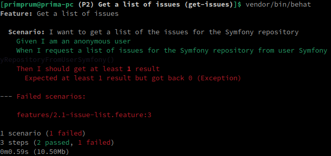

## Issues on Repo Availability Test (Github API)

In this test, we're trying to use Behat to check if we could connect to the Github API, check the availability of issues on particular username and it's repo, and then asserting that we could at least get 1 result of it.

<br>

So, our feature file will be like this:

```gherkin
Feature: Get a list of issues

  Scenario: I want to get a list of the issues for the Symfony repository
    Given I am an anonymous user
    When I request a list of issues for the Symfony repository from user Symfony
    Then I should get at least 1 result
```

<br>

On project workspace, we could first generate the function:

```bash
vendor/bin/bash
```

<br>

Then, we'll get the generated functions like this:

```php
/**
 * @Given I am an anonymous user
 */
public function iAmAnAnonymousUser()
{
    // stuff
}

/**
 * @When I request a list of issues for the Symfony repository from user Symfony
 */
public function iRequestAListOfIssuesForTheSymfonyRepositoryFromUserSymfony()
{
    // stuff
}

/**
 * @Then I should get at least :arg1 result
 */
public function iShouldGetAtLeastResult($arg1)
{
    // stuff
}
```

<br>

But, before we could fill the function with the things we're going to do, we need to connect to the Github API first as a client.

We could create an instance like this using constructor:

```php
public function __construct()
{
    $this->client = new \Github\Client();
}
```

Also, don't forget to declare the variable outside all the function:

```php
protected $client = null;
```

<br>

### Given: I am an anonymous user

This generates function `iAmAnAnonymousUser()`.

In this case, we're gonna connect into Github API as an anonymous user. By default, we're already anonymous for just checking issues on particular username and repo.

So, we do nothing:

```php
public function iAmAnAnonymousUser()
{
    // do nothing
}
```

<br>

### When: I request a list of issues for the Symfony repository from user Symfony

This generates function `iRequestAListOfIssuesForTheSymfonyRepositoryFromUserSymfony()`.

We could then fill it with this:

```php
public function iRequestAListOfIssuesForTheSymfonyRepositoryFromUserSymfony()
{
    $issues = $this->client->issues()->all('Symfony', 'Symfony');

    $this->results = $issues;
}
```

Don't forget to declare variable `$results`:

```php
protected $results = null;
```

<br>

### Then: I should get at least 1 result

This generates function `iShouldGetAtLeastResult($arg1)`.

After we could received the result from the request, we need to make sure that we're getting at least 1 result from the request.

We can code it like this:

```php
public function iShouldGetAtLeastResult($arg1)
{
    if (count($this->results) < $arg1) {
        throw new Exception("Expected at least $arg1 result but got back " . count($this->results));
    }
}
```

Because it uses parameter `$arg1`, we could set the minimum result depending on how much we want.

So, in feature file we could set it like this:

```gherkin
Then I should get at least 1 result
```

or, using another number, for example:

```gherkin
Then I should get at least 5 result
```

<br>

### Running the test

We'll get this result:


<br>

### Negative test

Suppose that we want to test a Github user with it's repo where it has no issues at all. In here, I'm gonna use my own:

```php
public function iRequestAListOfIssuesForTheSymfonyRepositoryFromUserSymfony()
{
    $issues = $this->client->issues()->all('primprum', 'get-issues');

    $this->results = $issues;
}
```

Remember that we're expecting at least 1 result of it:

```gherkin
Then I should get at least 1 result
```

Thus, it must gives us an error:



In there we could see that it is expecting it to give 1 result, but the response only gives 0 result (no issues).

<br>

### Summary: What's the purpose of this test?

From this test, we could gather several understanding:

**Endpoint Availability** <br> The test verifies that the API endpoint for fetching issues from the Symfony repository is accessible and returns a response.

> If the test passes, it indicates that the endpoint is reachable and functioning as expected.

<br>

**Data Integrity** <br> By checking that the number of issues returned is at least 1, the test ensures that the API response contains some data.

> If the test passes, it helps ensure the integrity of the data returned by the API.

<br>

**API Integration** <br> The successful execution of the test demonstrates that the PHP code can successfully integrate with the GitHub API using the specified PHP library (\Github\Client).

> If the test passes, this indicates that the API client is correctly configured and able to make requests to the GitHub API.

<br>

### What this test couldn't do?

Despite successfully ensuring the **Endpoint Availability**, **Data Integrity**, and **API Integration**, there are other things we could add from this test:

**Response Validation** <br> The test doesn't validate the content or structure of the issues returned by the API. While it confirms the presence of at least one issue, it doesn't validate whether the issues contain the expected data or adhere to a specific format.

> Additional tests could be added to validate the structure and content of the API response.

<br>

**Authentication** <br> The test assumes that the API endpoint doesn't require authentication for fetching issues from the Symfony repository.

> If authentication were required, additional steps would be needed in the test setup to authenticate with the API.

<br>

**Error Handling** <br> The test doesn't handle potential errors that may occur during the API request, such as network errors, rate limiting, or unexpected responses.

> Adding error handling and assertions for different error scenarios would provide more comprehensive API testing coverage.

<br>

### Conclusion

This test provides a basic validation of the API endpoint's availability and the integrity of the data returned. However, to ensure thorough API testing, additional tests should be added to cover various scenarios, including different input data, error conditions, and authentication requirements.
